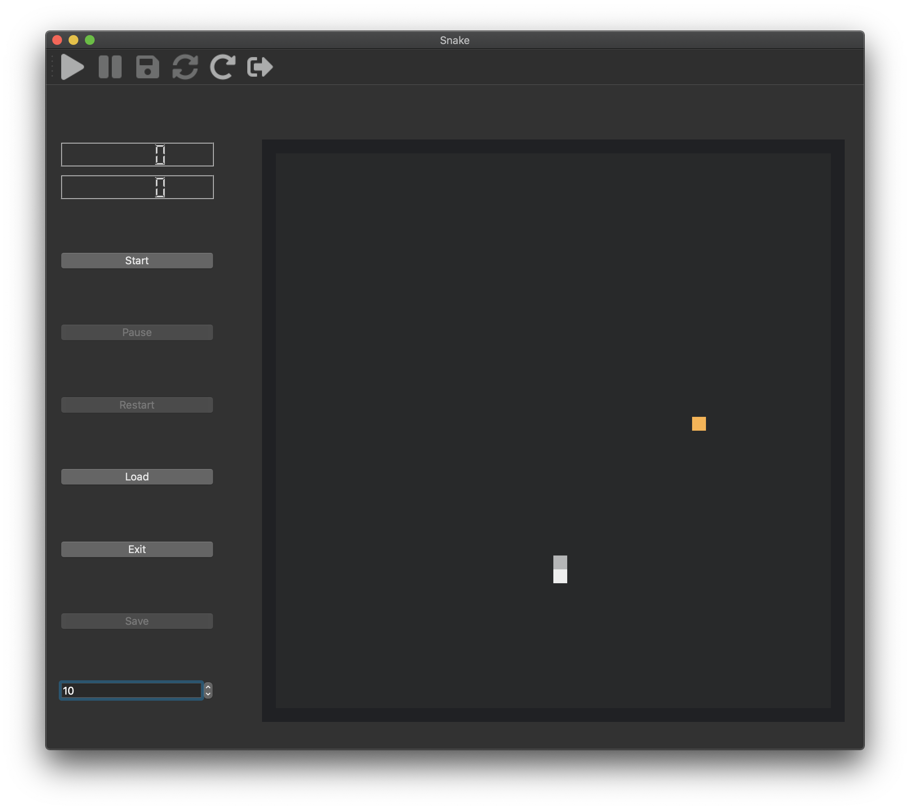
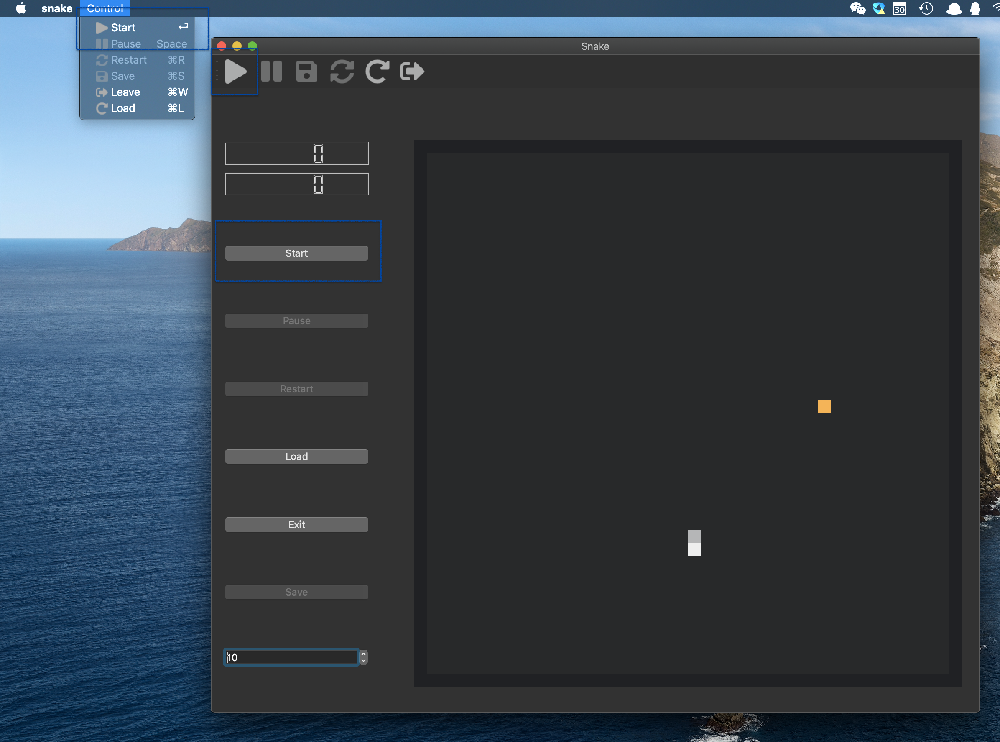
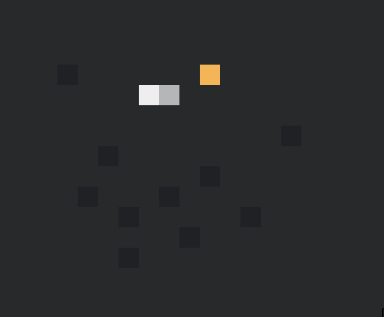
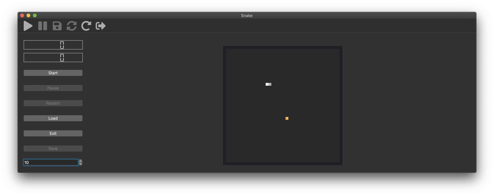
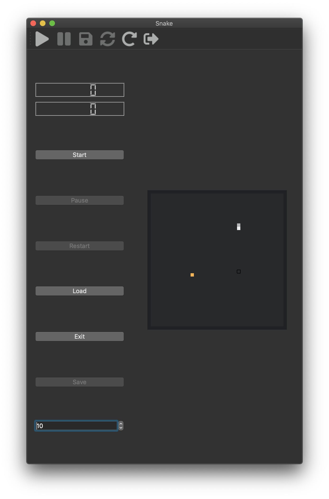

[TOC]

# 测试环境

- OS: macOS 10.15.6
- Processor: 2.3 GHz Dual-Core Intel Core i5
- Memory: 8 GB 2133 MHz LPDDR3
- Graphics: Intel Iris Plus Graphics 640 1536 MB

# 使用方式



## 流程控制

首先，作业中所需要的那些功能我都进行了实现。在任何一个状态之下，用户都可以通过侧边栏的按钮、顶部的工具栏和左上角的菜单栏对游戏的进度进行控制。注意到，在游戏的任意一个状态中，只有部分的按钮是可以选中的。

在任意一个控制区域中，可选的按钮有

- Start: 开始游戏
- Pause: 暂停游戏 / 继续游戏
- Restart: 重新开始游戏
- Load: 加载存档
- Save: 保存存档
- Exit: 退出游戏

游戏分为四个状态，分别是 

- Origin: 未开始状态
- Running: 运行状态
- Pause: 暂停状态
- Over: 结束状态

在每个状态中，只有部分按钮是可选的，下面是具体的表格

|         | Start | Pause | Restart | Load | Save | Exit |
| :-----: | :---: | :---: | :-----: | :--: | :--: | :--: |
| Origin  |   ✔️   |   ❌   |    ❌    |  ✔️   |  ❌   |  ✔️   |
| Running |   ❌   |   ✔️   |    ❌    |  ❌   |  ❌   |  ✔️   |
|  Pause  |   ❌   |   ✔️   |    ✔️    |  ✔️   |  ✔️   |  ✔️   |
|  Over   |   ❌   |   ❌   |    ✔️    |  ✔️   |  ❌   |  ✔️   |

同时，在 Origin、Pause 以及 Over 状态中，用户还可以通过左下角的 SpinBox 调整贪吃蛇的移动速度，单位是格每秒。

## 障碍摆放

在 Origin 和 Pause 状态中，用户可以自行设置障碍。将光标悬浮在对应的网格上时，游戏会追踪光标，通过一个方形轮廓提示将要摆放的障碍的位置。单击左键即可设置对应的障碍，这时对应的格子颜色会加深。

 



如果需要取消相应的障碍，只需要在同样的地方再次单击左键即可。

## 存档与读档

在进行存档与读档时，游戏的进度会被保存在一个 JSON 文件中。当我们需要对当前的局面进行存档时，点击 Save 游戏会生成一个 JSON 文件，当我们需要恢复游戏的进度时，点击 Load 并选择相应的 JSON 文件即可。

在进行读档时，如果所需的内容有缺失，或者文件内容无法被解析为 JSON，那么游戏会弹出窗口提示报错。

下面是一个合法的游戏存档格式的实例

```json
{"barriers":["(19, 23)","(21, 10)","(30, 6)","(33, 13)"],"body":["(5, 14)","(6, 14)","(7, 14)","(8, 14)","(9, 14)","(10, 14)","(11, 14)","(12, 14)","(13, 14)","(14, 14)","(15, 14)"],"bonus":"(27, 16)","bonusCnt":0,"direction":0,"height":40,"status":2,"timeFromStart":80,"width":40}
```


## 分数与游戏时间

在左上角的两个 LCD 效果的显示屏中，分别显示了游戏的分数与运行时间。其中游戏的分数代表了当前的贪吃蛇的长度，游戏的运行时间代表了蛇头所走过的长度。


# 设计架构

在我的实现过程中，遵循了软件设计的一般性准则，即尽可能减少不同模块之间的耦合度。我主要依靠三个类来实现游戏的运行，分别是 `Snake`、`SnakeCore` 以及 `SnakeBoard`。

其中，`Snake` 是游戏的主界面，负责处理用户的控制（Control），如摆放障碍、暂停游戏与读写存档之类的行为。`SnakeCore` 负责处理贪吃蛇游戏本身的逻辑（Model），如果实的生成、蛇身的移动与碰撞障碍的侦测等。`SnakeBoard` 负责界面的绘制与鼠标的追踪等。

这样一来，虽然我当前基于的框架是 Qt 提供的，但是当我需要将我的游戏移植到 Qt 所不支持的平台时，只需要重写 `Snake` 与 `SnakeBoard`，这样 `SnakeCore` 中的代码就可以得到复用了。

# Bug ? Feature !

在实现过程中，针对一些也许比较常见的问题，我给出了自己的处理方式。

## 响应式界面布局

在大部分人的实现中，游戏本身的界面是不可拖动的，这就大大限制了游戏本身的运行场景。针对这个问题，我将游戏中网格的大小设置为动态的，根据界面的大小进行动态调整。这样在不同的窗口大小下，都可以呈现最佳的游戏界面。





## 连续按键的侦测

针对贪吃蛇的移动，一般的实现方式为经过一段时间释放一个信号，提示蛇进行移动。在这个过程中，当我们需要改变方向时只是改变一个变量，而并不直接作用于蛇的移动。

这样带来的问题是，当我们快速改变蛇的方向时，如果两次操作在一次移动的时间段中，那么前一个操作就会被后一个操作所覆盖。这个问题有两个表现形式，一种是我们可以通过快速的按下侧边和反方向，这样会使得蛇产生“逆行”的行为；第二种是我们需要把蛇进行移动一格后快速改变方向时，往往会失败。

针对这个问题，我的处理方式是设计了一个操作队列，每次有方向改变的操作出现时，先把这个操作放到操作队列中，并不直接改变方向的变量。而当蛇需要进行移动时，先从操作队列里取出一个合法的操作，然后再进行移动。这样就很好的解决了我们前面所遇到的问题。